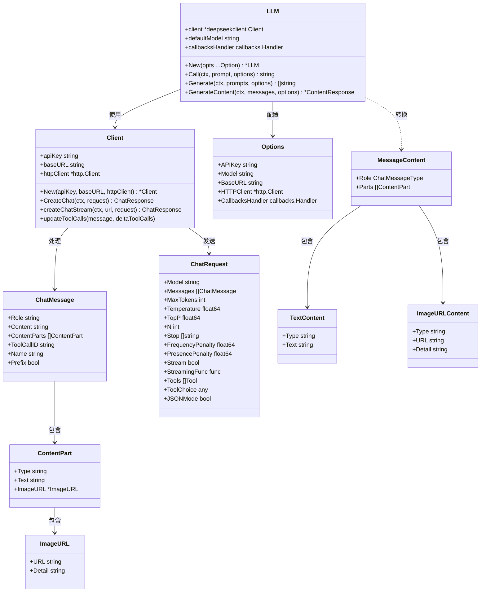
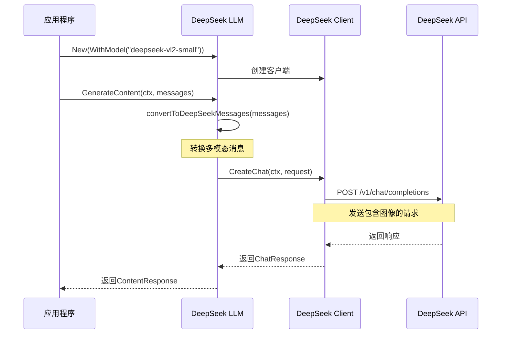
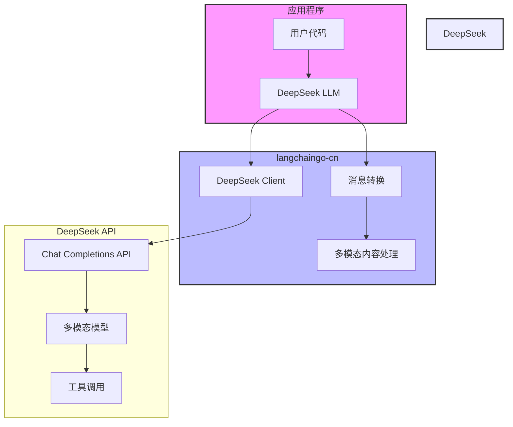

# DeepSeek 多模态模型架构分析

## 1. 概述

DeepSeek 提供了多种多模态模型，用于处理文本和图像的组合输入。本文档将分析 DeepSeek 多模态模型的架构、实现和使用方法，特别是在 `langchaingo-cn` 中的集成。

## 2. DeepSeek 多模态模型系列

DeepSeek 提供了以下多模态模型系列：

### 2.1 DeepSeek-VL 系列

DeepSeek-VL 是 DeepSeek 的第一代视觉语言模型系列，包括：

- **DeepSeek-VL-1.3B**：13亿参数的视觉语言模型
- **DeepSeek-VL-7B**：70亿参数的视觉语言模型

每种参数规模都有 base 和 chat 两个版本。

### 2.2 DeepSeek-VL2 系列

DeepSeek-VL2 是 DeepSeek 最新开源的一系列大型混合专家（Mixture-of-Experts，MoE）视觉语言模型，在 DeepSeek-VL 的基础上进行了显著改进。包括：

- **DeepSeek-VL2-Tiny**：1.0B 激活参数
- **DeepSeek-VL2-Small**：2.8B 激活参数
- **DeepSeek-VL2**：4.5B 激活参数

DeepSeek-VL2 在多种任务上展现出卓越的能力，包括视觉问答、OCR、文档/表格/图表理解以及视觉定位等。

## 3. 在 langchaingo-cn 中的实现

### 3.1 代码结构

```
/llms/deepseek/
  ├── deepseekllm.go            # DeepSeek LLM 的主要实现
  ├── deepseekllm_option.go     # DeepSeek LLM 的配置选项
  └── internal/deepseekclient/
      ├── deepseekclient.go     # DeepSeek API 客户端
      └── chat.go               # 聊天相关的数据结构和方法
```

### 3.2 多模态消息处理

在 `deepseekllm.go` 中，`convertToDeepSeekMessages` 函数负责将 `langchaingo` 的消息内容转换为 DeepSeek API 所需的格式：

```go
// convertToDeepSeekMessages converts langchaingo message content to DeepSeek messages.
func convertToDeepSeekMessages(messages []llms.MessageContent) ([]deepseekclient.ChatMessage, error) {
    deepseekMessages := make([]deepseekclient.ChatMessage, 0, len(messages))

    for _, message := range messages {
        role, err := convertMessageType(message.Role)
        if err != nil {
            return nil, err
        }

        // 处理纯文本内容
        if len(message.Parts) == 1 {
            if textContent, ok := message.Parts[0].(llms.TextContent); ok {
                deepseekMessages = append(deepseekMessages, deepseekclient.ChatMessage{
                    Role:    role,
                    Content: textContent.Text,
                })
                continue
            }
        }

        // 处理多模态内容
        contentParts := make([]deepseekclient.ContentPart, 0, len(message.Parts))
        for _, part := range message.Parts {
            switch p := part.(type) {
            case llms.TextContent:
                contentParts = append(contentParts, deepseekclient.ContentPart{
                    Type: "text",
                    Text: p.Text,
                })
            case llms.ImageURLContent:
                contentParts = append(contentParts, deepseekclient.ContentPart{
                    Type: "image_url",
                    ImageURL: &deepseekclient.ImageURL{
                        URL:    p.URL,
                        Detail: p.Detail,
                    },
                })
            // ... 其他类型处理
            }
        }

        // 如果有多模态内容，创建带有内容部分的消息
        if len(contentParts) > 0 {
            deepseekMessages = append(deepseekMessages, deepseekclient.ChatMessage{
                Role:         role,
                ContentParts: contentParts,
            })
        }
    }

    return deepseekMessages, nil
}
```

### 3.3 多模态数据结构

在 `chat.go` 中定义了支持多模态内容的数据结构：

```go
// ChatMessage represents a message in a chat conversation.
type ChatMessage struct {
    // Role is the role of the message sender (system, user, assistant, tool).
    Role string `json:"role"`
    // Content is the content of the message.
    Content string `json:"content,omitempty"`
    // ContentParts is the multi-modal content parts of the message.
    ContentParts []ContentPart `json:"content_parts,omitempty"`
    // ... 其他字段
}

// ContentPart represents a part of a multi-modal message content.
type ContentPart struct {
    // Type is the type of the content part (text, image_url).
    Type string `json:"type"`
    // Text is the text content.
    Text string `json:"text,omitempty"`
    // ImageURL is the image URL content.
    ImageURL *ImageURL `json:"image_url,omitempty"`
}

// ImageURL represents an image URL content part.
type ImageURL struct {
    // URL is the URL of the image.
    URL string `json:"url"`
    // Detail is the detail level of the image (low, high).
    Detail string `json:"detail,omitempty"`
}
```

## 4. 使用示例

以下是使用 DeepSeek 多模态模型的示例代码：

```go
package main

import (
    "context"
    "fmt"
    "log"
    "os"
    "path/filepath"

    "github.com/sjzsdu/langchaingo-cn/llms/deepseek"
    "github.com/tmc/langchaingo/llms"
)

func main() {
    // 初始化DeepSeek客户端
    llm, err := deepseek.New(
        deepseek.WithModel("deepseek-vl2-small"), // 使用DeepSeek的视觉语言模型
    )
    if err != nil {
        log.Fatal(err)
    }

    ctx := context.Background()

    // 获取图像文件的绝对路径
    imageFilePath, err := filepath.Abs("./image.jpg")
    if err != nil {
        log.Fatal(err)
    }

    // 创建图像URL内容
    imageURL := llms.ImageURLContent{
        URL:    fmt.Sprintf("file://%s", imageFilePath),
        Detail: "high", // 可选值: "low", "high"
    }

    // 创建多模态消息内容
    messages := []llms.MessageContent{
        {
            Role: llms.ChatMessageTypeSystem,
            Parts: []llms.ContentPart{
                llms.TextContent{
                    Text: "你是一个专业的图像分析助手，擅长分析图像内容并提供详细描述。",
                },
            },
        },
        {
            Role: llms.ChatMessageTypeHuman,
            Parts: []llms.ContentPart{
                llms.TextContent{
                    Text: "请详细描述这张图片中的内容。",
                },
                imageURL,
            },
        },
    }

    // 生成内容
    completion, err := llm.GenerateContent(
        ctx,
        messages,
        llms.WithMaxTokens(1000),
        llms.WithTemperature(0.7),
    )
    if err != nil {
        log.Fatal(err)
    }

    // 输出结果
    fmt.Println("图像分析结果:")
    if len(completion.Choices) > 0 {
        fmt.Println(completion.Choices[0].Content)
    }
}
```

## 5. 注意事项

1. 在使用 DeepSeek 多模态模型时，需要指定正确的模型名称。目前可用的多模态模型包括：
   - `deepseek-vl2-tiny`
   - `deepseek-vl2-small`
   - `deepseek-vl2`

2. 示例代码中使用的 `deepseek-vision` 模型名称不存在，应该使用上述正确的模型名称。

3. 图像可以通过 URL 或本地文件路径提供，本地文件需要使用 `file://` 前缀。

4. 图像细节级别可以设置为 `low` 或 `high`，影响模型对图像的处理精度。

## 6. 架构图

### 6.1 类图



### 6.2 序列图



### 6.3 组件图



## 7. 结论

DeepSeek 多模态模型在 `langchaingo-cn` 中的实现支持文本和图像的组合输入，可以用于图像分析、视觉问答等任务。通过正确配置模型名称和参数，可以充分利用 DeepSeek 多模态模型的能力。

在使用时，需要注意选择正确的模型名称，目前应该使用 DeepSeek-VL2 系列模型，如 `deepseek-vl2-tiny`、`deepseek-vl2-small` 或 `deepseek-vl2`，而不是示例中使用的 `deepseek-vision`。

通过本文档的分析，我们可以看到 DeepSeek 多模态模型在 `langchaingo-cn` 中的实现是灵活且强大的，支持各种多模态场景的应用开发。