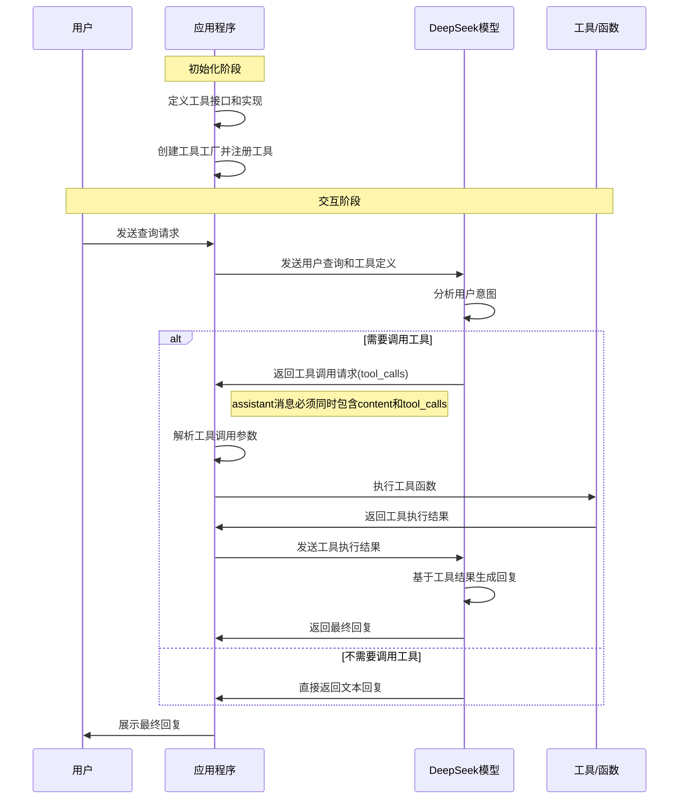

# DeepSeek 工具调用示例

这个示例展示了如何使用 LangChain Go 与 DeepSeek API 进行工具调用（Function Calling），使模型能够调用外部函数获取信息。

## 功能

- 定义和注册自定义工具（函数）
- 让 DeepSeek 模型决定何时调用工具
- 处理工具调用结果并将其返回给模型
- 获取模型基于工具调用结果的最终回复

## 使用方法

1. 确保你有 DeepSeek API 密钥
3. 运行示例：

```bash
go run deepseek-tool-call-example.go
```

## 代码说明

这个示例实现了一个简单的天气查询工具，并将其注册到 DeepSeek 模型。当用户询问天气相关问题时，模型会自动决定调用天气工具获取信息，然后基于获取的信息提供回答。

示例中的关键部分：

1. **定义工具**：使用 `llms.Tool` 结构定义工具的名称、描述和参数
2. **注册工具**：使用 `llms.WithTools` 选项将工具注册到模型
3. **处理工具调用**：检测模型的响应中是否包含工具调用请求
4. **执行工具函数**：解析参数并执行相应的函数
5. **返回结果**：将工具执行结果返回给模型，获取最终回复

## DeepSeek 工具调用流程

以下泳道图展示了 DeepSeek 工具调用的完整流程：



### 工具调用关键技术细节

1. **消息格式**：
   - 系统消息：设置模型行为和上下文
   - 用户消息：包含用户的查询内容
   - 助手消息：当包含工具调用时，必须同时设置 `content` 和 `tool_calls` 字段
   - 工具响应消息：包含工具执行的结果

2. **工具定义格式**：
   ```go
   llms.Tool{
       Type: "function",
       Function: &llms.FunctionDefinition{
           Name:        "get_weather",
           Description: "获取指定位置和日期的天气信息",
           Parameters:  {...},
       },
   }
   ```

3. **注意事项**：
   - 当 `assistant` 角色有工具调用时，`content` 字段不能为空（本示例中使用空格字符）
   - 工具调用的 ID 需要在工具响应中保持一致
   - 参数解析和错误处理是实现健壮工具调用的关键

## 工具调用的应用场景

- 实时数据查询（天气、股票、新闻等）
- 执行计算或数据处理
- 与外部API或数据库交互
- 执行特定领域的专业操作

## 注意事项

- 确保工具定义清晰，包含准确的参数描述
- 处理工具调用中可能出现的错误
- 根据需要调整模型名称和参数