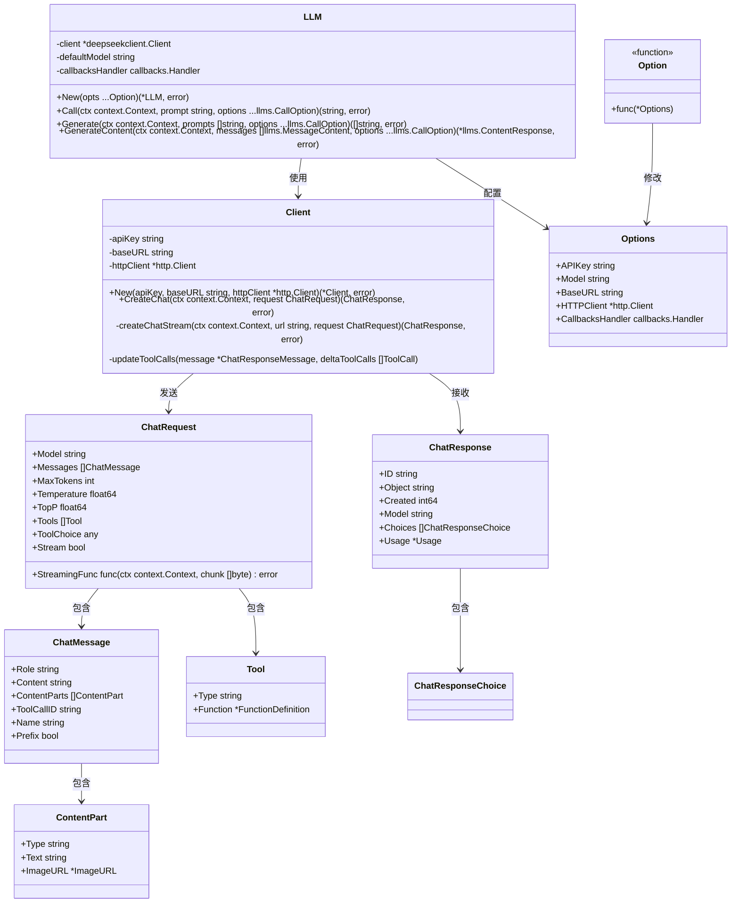
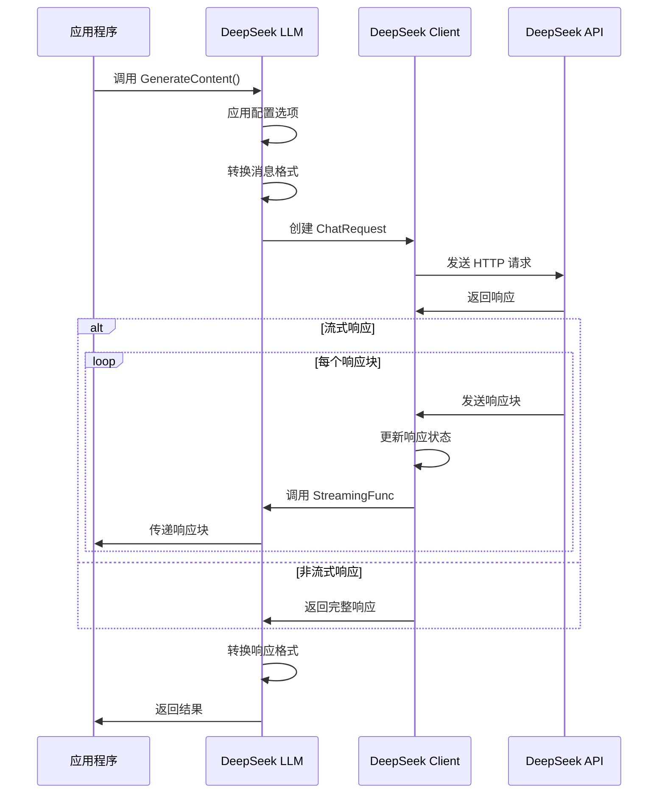

# DeepSeek LLM 包使用说明

## 概述

DeepSeek LLM 包是 LangChain Go 中用于与 DeepSeek API 进行交互的客户端实现。该包提供了一套完整的接口，用于发送请求到 DeepSeek 的大语言模型服务，并处理返回的响应。

## 架构设计



## 核心组件

### 1. LLM

`LLM` 是包的主要入口点，它封装了与 DeepSeek API 的交互逻辑：

- **属性**：
  - `client`：DeepSeek API 客户端
  - `defaultModel`：默认使用的模型名称
  - `callbacksHandler`：回调处理器，用于处理生命周期事件

- **方法**：
  - `New`：创建新的 LLM 实例
  - `Call`：发送单个提示并获取响应
  - `Generate`：发送多个提示并获取响应
  - `GenerateContent`：发送结构化消息并获取响应，支持多模态内容和工具调用

### 2. 配置选项

包使用函数式选项模式进行配置：

- **Options**：包含所有配置选项的结构体
- **Option**：修改 Options 的函数类型
- **配置函数**：
  - `WithAPIKey`：设置 API 密钥
  - `WithModel`：设置模型名称
  - `WithBaseURL`：设置 API 基础 URL
  - `WithHTTPClient`：设置 HTTP 客户端
  - `WithCallbacksHandler`：设置回调处理器

### 3. DeepSeek 客户端

`deepseekclient` 包实现了与 DeepSeek API 的底层通信：

- **Client**：API 客户端
  - `CreateChat`：创建聊天完成请求
  - `createChatStream`：处理流式响应
  - `updateToolCalls`：更新工具调用信息

### 4. 请求和响应类型

- **ChatMessage**：聊天消息
- **ContentPart**：多模态内容部分
- **ChatRequest**：聊天请求
- **ChatResponse**：聊天响应
- **Tool**：工具定义
- **ToolCall**：工具调用

## 功能特性

1. **基本文本生成**：通过 `Call` 和 `Generate` 方法支持基本的文本生成
2. **多模态支持**：支持文本和图像输入
3. **工具调用**：支持定义和使用工具
4. **流式响应**：支持流式接收生成内容
5. **回调机制**：支持生命周期事件的回调处理

## 工作流程



## 设计模式

1. **函数式选项模式**：使用函数来配置 LLM 实例，提供灵活的配置方式
2. **适配器模式**：在 LangChain 接口和 DeepSeek API 之间进行转换
3. **策略模式**：支持不同的请求策略（流式/非流式）
4. **观察者模式**：通过回调机制实现生命周期事件的观察

## 使用示例

设置一下 DeepSeek API 密钥
```
export DEEPSK_API_KEY=your-api-key
```

```go
llm, err := deepseek.New(
    deepseek.WithAPIKey("your-api-key"),
    deepseek.WithModel("deepseek-chat"),
)
if err != nil {
    // 处理错误
}

// 基本文本生成
response, err := llm.Call(ctx, "你好，请介绍一下自己")

// 多模态内容生成
messages := []llms.MessageContent{
    {
        Role: llms.ChatMessageTypeHuman,
        Parts: []llms.ContentPart{
            llms.TextContent{Text: "这张图片是什么?"},
            llms.ImageURLContent{URL: "https://example.com/image.jpg"},
        },
    },
}
contentResponse, err := llm.GenerateContent(ctx, messages)

// 工具调用
tools := []llms.Tool{
    {
        Type: "function",
        Function: &llms.FunctionDefinition{
            Name: "get_weather",
            Description: "获取天气信息",
            Parameters: map[string]interface{}{
                "type": "object",
                "properties": map[string]interface{}{
                    "location": map[string]interface{}{
                        "type": "string",
                        "description": "城市名称",
                    },
                },
                "required": []string{"location"},
            },
        },
    },
}
contentResponse, err := llm.GenerateContent(ctx, messages, llms.WithTools(tools))
```

## 总结

DeepSeek LLM 包提供了一个完整的接口，用于与 DeepSeek API 进行交互。它支持基本的文本生成、多模态内容、工具调用和流式响应等功能。该包采用了函数式选项模式进行配置，使用适配器模式在 LangChain 接口和 DeepSeek API 之间进行转换，并通过回调机制支持生命周期事件的处理。